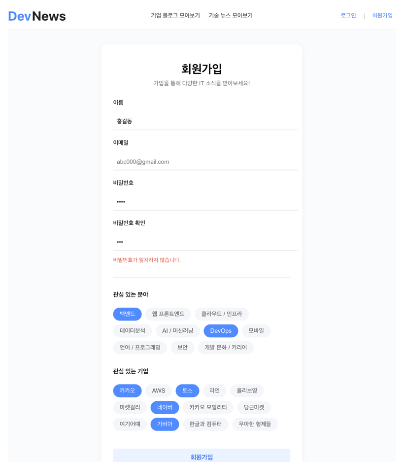
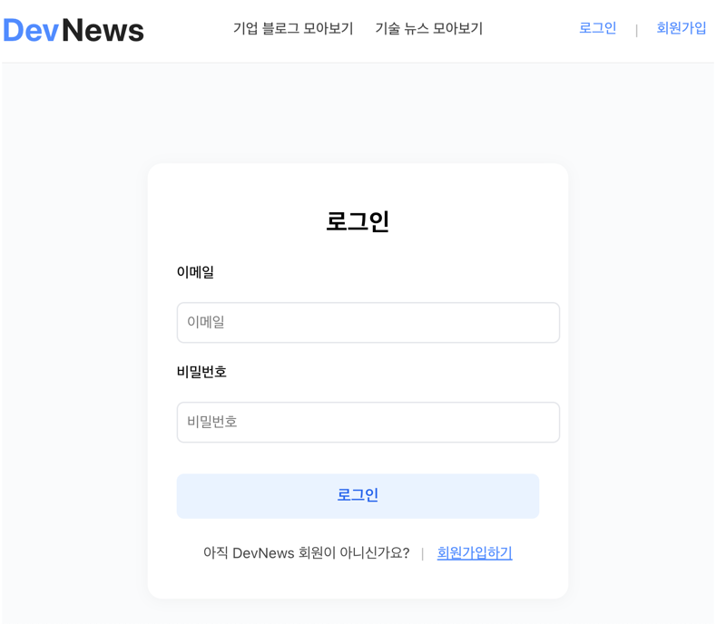
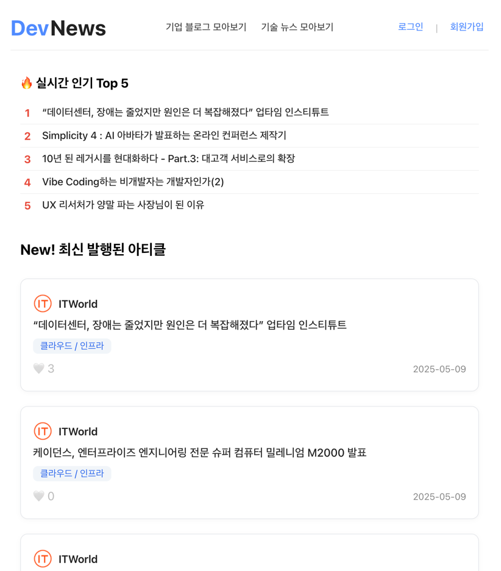
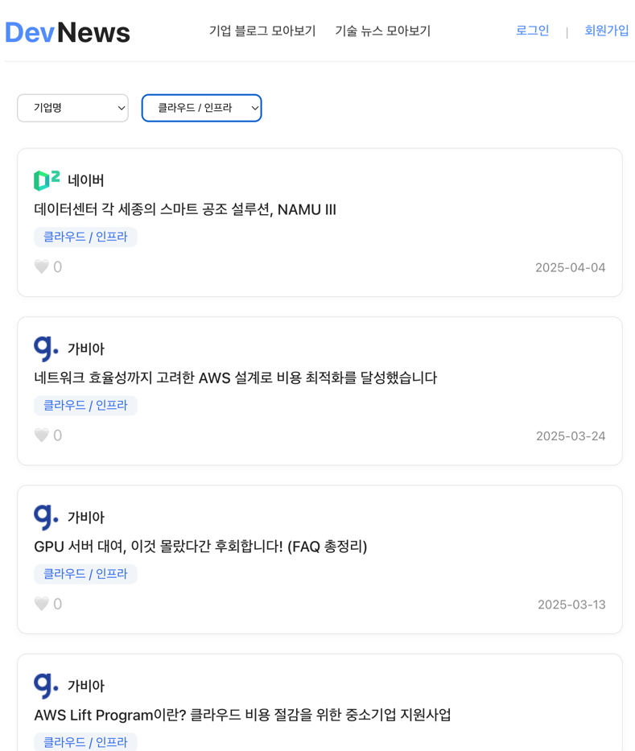
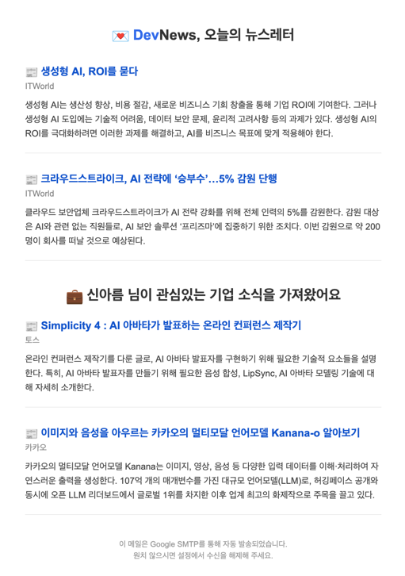

# 💌 KERNEL360 HACKERTHON Team.DevNews
- - -
2025.05.07(수) ~ 2025.05.09(금)

DevNews를 통해 다양한 IT 소식을 메일로 받아보세요!

## 🧑🏻‍🏫 프로젝트 소개
- - -
DevNews는 다양한 기업의 기술 블로그, IT 플랫폼에서 제공하는 최신 콘텐츠를 한 곳에서 모아 조회할 수 있는 개발자를 위한 서비스입니다.

회원은 본인이 관심 있는 기술 분야와 기업을 설정하여 관련 테크 소식을 이메일로 편리하게 받아볼 수 있는 개인 맞춤형 서비스를 제공합니다. 메일에서는 핵심 내용을 간결하게 요약해주며, 메인 페이지에서는 주제별, 기업별로 분류하여 아티클을 조회할 수 있습니다.

매일 쏟아지는 수많은 정보 속에서 중요한 내용만을 빠르게 확인할 수 있어 시간 절약과 업무 효율성을 높이는데 도움을 줄 수 있는 서비스입니다.

## 📚 사용 기술 스택

- Java 17
- Spring Boot 3.4.5
- Spring Security
- Spring Data JPA
- MySQL
- JWT Authentication
- Spring Mail (SMTP)

## 📑 주요 기능

### 1. 사용자 인증 (회원가입, 로그인)
Spring security와 jwt를 활용하여 구현.



### 2. 홈 화면 조회


### 3. 기업별, 분야별 아티클 조회


### 4. 메일 발송
회원가입 시 선택한 기업과 분야의 아티클을 매일 한 번씩 가입한 이메일로 발송하는 기능.
Gmail SMTP를 사용했으며 @Scheduled를 통해 특정 시간에 일괄적으로 user 순회를 돌며 메일을 발송하도록 구현.


## 🏛️ 프로젝트 구조

```
src/main/java/org/example/devnews/
├── config/         # 설정 클래스
│   ├── SecurityConfig.java
│   └── SwaggerConfig.java
│
├── domain/         # 엔티티 클래스
│   ├── article/    # 뉴스 기사 관련 엔티티
│   ├── category/   # 카테고리 엔티티
│   ├── company/    # 회사 정보 엔티티
│   ├── interestcategory/  # 관심 카테고리 엔티티
│   ├── interestcompany/   # 관심 회사 엔티티
│   ├── like/       # 좋아요 엔티티
│   └── user/       # 사용자 엔티티
│
├── dto/            # 데이터 전송 객체
│   ├── request/    # 요청 DTO
│   └── response/   # 응답 DTO
│
├── ex/             # 예외 처리
│   ├── GlobalExceptionHandler.java
│   └── CustomException.java
│
├── service/        # 비즈니스 로직
│   ├── ArticleService.java
│   ├── UserService.java
│   ├── LikeService.java
│   └── SmtpService.java
│
├── util/           # 유틸리티 클래스
│   ├── JwtUtil.java
│   └── SecurityUtil.java
│
├── validate/       # 유효성 검사
│   └── Validator.java
│
└── web/            # 컨트롤러
    ├── ArticleController.java
    ├── UserController.java
    └── LikeController.java
```

## ⚙️ 주요 컴포넌트 설명

#### 도메인 (Domain)
- `article`: 뉴스 기사 정보를 관리하는 엔티티
- `category`: 뉴스 카테고리 정보를 관리하는 엔티티
- `company`: 회사 정보를 관리하는 엔티티
- `interestcategory`: 사용자의 관심 카테고리를 관리하는 엔티티
- `interestcompany`: 사용자의 관심 회사를 관리하는 엔티티
- `like`: 사용자의 좋아요 정보를 관리하는 엔티티
- `user`: 사용자 정보를 관리하는 엔티티

#### 서비스 (Service)
- `ArticleService`: 뉴스 기사 관련 비즈니스 로직 처리
- `UserService`: 사용자 관련 비즈니스 로직 처리
- `LikeService`: 좋아요 관련 비즈니스 로직 처리
- `SmtpService`: 이메일 발송 관련 비즈니스 로직 처리

#### 컨트롤러 (Controller)
- `ArticleController`: 뉴스 기사 관련 API 엔드포인트 제공
- `UserController`: 사용자 관련 API 엔드포인트 제공
- `LikeController`: 좋아요 관련 API 엔드포인트 제공

## ✅ 시작하기

### 필수 조건

- Java 17
- MySQL
- Gradle

### API 문서

Swagger UI를 통해 API 문서를 확인할 수 있습니다:
```
http://localhost:8080/swagger-ui.html
```

### 개발 환경 설정

1. MySQL 데이터베이스 설정
2. SMTP 서버 설정 (이메일 인증용)
3. JWT 시크릿 키 설정
